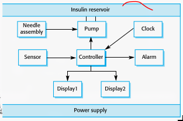
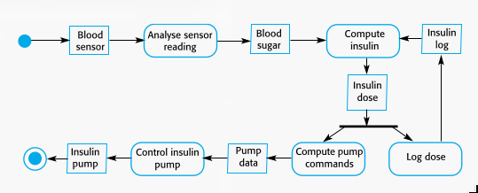
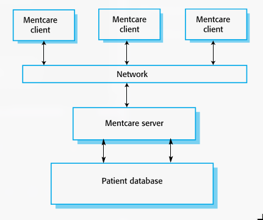
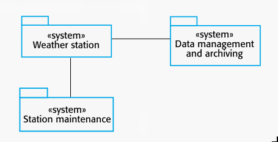
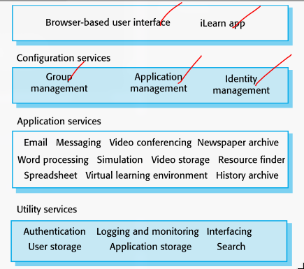

## Syllabus
- Introduction
  - Professional Software Development
  - Software Engineering Ethics
  - Case Studies
    - Personal Insulin Pump
    - Mental Health Case Patient Management System (Mentcare)
    - Wilderness Weather Station
    - iLearn: A Digital Learning Environment
- Software Process Models
  - Software Process Models
    - Waterfall Model
    - Incremental Development
    - Integration and Configuration
  - Process Activities
    - Software Specification
    - Software Development
    - Software Validation
    - Software Evolution
  - Coping With Change
    - Software Prototyping
    - Incremental Delivery
- Agile Software Development
## Agile Software Development

Agile software development is an iterative and incremental approach to software development that emphasizes flexibility, collaboration, and customer feedback. It is designed to accommodate changing requirements and deliver high-quality software quickly.

### Agile Methods

Agile methods are a set of practices and frameworks that prioritize adaptability, customer involvement, and rapid delivery. Below are the key agile methods:

#### Principles of Agile Methods

Agile methods are guided by the following principles:

1. **Customer Involvement**: Customers are closely involved throughout the development process, providing feedback and prioritizing requirements.
2. **Incremental Delivery**: Software is developed and delivered in small increments, allowing for frequent feedback and adjustments.
3. **People, Not Process**: The skills and collaboration of the development team are prioritized over rigid processes.
4. **Embrace Change**: Agile methods welcome changing requirements, even late in the development process.
5. **Maintain Simplicity**: Focus on simplicity in both the software and the development process to reduce complexity.

---

#### Extreme Programming (XP)

**Extreme Programming (XP)** is a well-known agile method that emphasizes technical excellence and customer satisfaction. Key practices include:

- **User Stories**: Requirements are captured as user stories, which are short descriptions of functionality from the user's perspective.
- **Test-First Development**: Tests are written before the code, ensuring that the software meets requirements from the outset.
- **Pair Programming**: Developers work in pairs, with one writing code and the other reviewing it in real-time.
- **Continuous Integration**: Code changes are integrated and tested frequently to catch issues early.
- **Refactoring**: Code is continuously improved to maintain simplicity and readability.

**Benefits**:
- High-quality code.
- Rapid delivery of functionality.
- Strong customer involvement.

---

#### Scrum

**Scrum** is an agile framework for managing and delivering complex projects. It is centered around short, iterative cycles called **sprints**, typically lasting 2-4 weeks. Key components include:

- **Product Backlog**: A prioritized list of features, enhancements, and bug fixes.
- **Sprint Planning**: The team selects items from the product backlog to work on during the sprint.
- **Daily Scrum**: A short daily meeting where team members discuss progress and plan the day's work.
- **Sprint Review**: A meeting at the end of the sprint to demonstrate the completed work to stakeholders.
- **Sprint Retrospective**: A reflection on the sprint to identify improvements for the next cycle.

**Roles in Scrum**:
- **Product Owner**: Represents the customer and prioritizes the product backlog.
- **Scrum Master**: Facilitates the Scrum process and removes obstacles for the team.
- **Development Team**: A cross-functional group responsible for delivering the product increment.

**Benefits**:
- Improved collaboration and communication.
- Flexibility to adapt to changing requirements.
- Regular delivery of valuable increments.

---

### Agile Development Techniques

Agile development relies on specific techniques to ensure efficiency, quality, and collaboration. Below are some key techniques:

#### User Stories

**User stories** are short, simple descriptions of a feature from the perspective of the end-user. They are used to capture requirements in an agile project.

**Format**:
```
As a [role], I want [feature] so that [benefit].
```

**Example**:
```
As a diabetic patient, I want my insulin pump to calculate the correct dose of insulin so that I can maintain healthy blood sugar levels.
```

**Benefits**:
- Focus on user needs.
- Easy to understand and prioritize.

---

#### Refactoring

**Refactoring** is the process of improving the structure and readability of code without changing its behavior. It is a continuous activity in agile development.

**Examples of Refactoring**:
- Renaming variables and methods for clarity.
- Removing duplicate code.
- Simplifying complex logic.

**Benefits**:
- Improves code maintainability.
- Reduces technical debt.
- Enhances collaboration by keeping the codebase clean and understandable.

---

#### Test-First Development

**Test-First Development** (also known as **Test-Driven Development or TDD**) involves writing tests before writing the code. This ensures that the code meets requirements and reduces the likelihood of defects.

**Process**:
1. Write a test for a small piece of functionality.
2. Run the test and ensure it fails (since the functionality is not yet implemented).
3. Write the minimal amount of code to pass the test.
4. Refactor the code to improve its structure.
5. Repeat the process for the next piece of functionality.

**Benefits**:
- Ensures code meets requirements.
- Reduces defects and improves quality.
- Encourages modular and maintainable code.

---

#### Pair Programming

**Pair Programming** involves two developers working together at a single workstation. One developer writes the code (the **driver**), while the other reviews it in real-time (the **observer** or **navigator**).

**Benefits**:
- Improves code quality through real-time review.
- Enhances knowledge sharing and collaboration.
- Reduces the risk of defects and errors.

---

### Agile Project Management

Agile project management focuses on delivering value to the customer through iterative development and continuous feedback. Key aspects include:

- **Iterative Planning**: Plans are updated regularly to reflect changing requirements and priorities.
- **Progress Tracking**: Progress is tracked using visual tools like burndown charts and Kanban boards.
- **Customer Collaboration**: Customers are involved throughout the project to ensure the delivered product meets their needs.
- **Adaptive Leadership**: Agile project managers (e.g., Scrum Masters) facilitate the process and remove obstacles for the team.

**Benefits**:
- Flexibility to adapt to change.
- Early and frequent delivery of value.
- Improved customer satisfaction.

---

### Scaling Agile Methods

Scaling agile methods involves adapting agile practices for larger projects or organizations. Challenges include:

- **Coordination**: Managing multiple teams working on interconnected components.
- **Consistency**: Ensuring consistent practices and standards across teams.
- **Communication**: Facilitating communication between distributed teams.

**Approaches to Scaling Agile**:

#### Scrum of Scrums

**Scrum of Scrums** is a technique for scaling Scrum to larger projects. It involves:

- **Regular Meetings**: Representatives from each Scrum team meet to discuss progress, dependencies, and obstacles.
- **Cross-Team Coordination**: Ensures alignment and collaboration between teams.

#### SAFe (Scaled Agile Framework)

**SAFe** is a framework for scaling agile practices across large organizations. It provides:

- **Structured Roles**: Defines roles and responsibilities for scaling agile.
- **Program Increment Planning**: Aligns multiple teams around a common goal for a fixed period.
- **Portfolio Management**: Ensures alignment between business strategy and agile teams.

**Benefits of Scaling Agile**:
- Improved collaboration and communication.
- Faster delivery of large, complex systems.
- Greater flexibility to adapt to change.
---

# Software Engineering Introduction

## Software Engineering Definition

**Software engineering** is an engineering discipline that is concerned with all aspects of software production from the early stages of system specification through to maintaining the system after it has gone into use.

Key aspects of software engineering:

- **Theories**: Foundational principles that guide software development.
- **Methods**: Structured approaches for designing, implementing, and maintaining software.
- **Tools**: Software and utilities that support the development process.

**Software engineering** is fundamental to the economies of ALL developed nations, as it ensures the development of reliable, cost-effective, and maintainable software systems.

## Software Costs

Software costs often dominate computer system costs, particularly on PCs where software expenses can exceed hardware costs.

Key cost considerations:

- **Development Costs**: Initial expenses for designing, coding, and testing software.
- **Maintenance Costs**: Ongoing expenses for updating, fixing, and improving software. Maintenance costs can be several times higher than development costs for long-lived systems.

**Software engineering is concerned with cost-effective software development**, ensuring that software is both affordable to produce and maintain.

## Software Project Failure

Software projects can fail due to a variety of reasons, often linked to increasing complexity and poor development practices.

### Increasing System Complexity

Modern software systems are becoming increasingly complex, leading to challenges such as:

- **Rapid Delivery**: Systems must be built and delivered more quickly to meet market demands.
- **Scalability**: Larger and more complex systems are required to handle advanced functionalities.
- **Innovation**: Systems must incorporate new capabilities that were previously thought to be impossible.

### Failure to Use Software Engineering Methods

Many organizations fail to adopt structured software engineering methods, leading to:

- **Ad Hoc Development**: Writing computer programs without following established software engineering practices.
- **Evolved Systems**: Companies often drift into software development as their products and services evolve, without formalizing their processes.
- **Poor Reliability and High Costs**: The absence of software engineering methods results in software that is more expensive to develop and maintain, and less reliable.

---

# Software Products

Software products can be categorized into two main types: **generic products** and **customized products**.

## Generic Products

**Generic products** are stand-alone systems developed for a broad market and sold to any customer who wishes to purchase them.

Examples:

- PC software such as graphics programs and project management tools.
- CAD (Computer-Aided Design) software.
- Software for specific markets, such as appointment systems for dentists.

**Product Specification**: The specification of what the software should do is owned by the **software developer**, and decisions on software changes are made by the developer.

## Customized Products

**Customized products** are software systems commissioned by a specific customer to meet their unique requirements.

Examples:

- Embedded control systems.
- Air traffic control software.
- Traffic monitoring systems.

**Product Specification**: The specification of what the software should do is owned by the **customer**, and they make decisions on software changes that are required.

---

# Product Specification

## Generic Products

The specification of what the software should do is owned by the **software developer** and decisions on software change are made by the developer.

## Customized Products

The specification of what the software should do is owned by the **customer for the software** and they make decisions on software changes that are required.

---

# Essential Attributes of Good Software

Good software must exhibit the following key attributes:

## Maintainability

**Maintainability** refers to the ease with which software can be modified to:

- Adapt to changing requirements.
- Fix bugs or vulnerabilities.
- Improve performance or other attributes.

Maintainability is critical because software change is inevitable in a dynamic business environment.

## Dependability and Security

**Dependability and security** encompass:

- **Reliability**: The software performs consistently without failure.
- **Security**: Protection against unauthorized access or malicious attacks.
- **Safety**: The software does not cause harm, even in the event of failure.

Dependable software should not cause physical or economic damage, and malicious users should not be able to compromise the system.

## Efficiency

**Efficiency** ensures that software makes optimal use of system resources, including:

- **Memory**: Minimizing memory usage.
- **Processor Cycles**: Reducing processing time.
- **Responsiveness**: Ensuring quick response times.

Efficient software avoids wasteful use of resources and enhances overall performance.

## Acceptability

**Acceptability** means that the software is suitable for its intended users. It must be:

- **Understandable**: Users can easily comprehend how to use the software.
- **Usable**: The software is intuitive and user-friendly.
- **Compatible**: The software works well with other systems and tools used by the target audience.

---

# Software Engineering

## Definition

**Software engineering** is an engineering discipline that encompasses all aspects of software production, from the early stages of system specification to maintaining the system after deployment. It focuses on applying structured, systematic approaches to software development to ensure reliability, efficiency, and maintainability.

## Engineering Discipline

Software engineering involves:

- Using **theories** and **methods** to solve complex problems.
- Considering **organizational** and **financial constraints** to deliver cost-effective solutions.

## All Aspects of Software Production

Software engineering is not limited to the technical process of development. It also includes:

- **Project Management**: Planning, organizing, and overseeing software projects.
- **Tool Development**: Creating and utilizing tools to support software development.
- **Process Improvement**: Continuously refining methods to enhance efficiency and quality.

---

# Importance of Software Engineering

Software engineering plays a critical role in modern society, as individuals and organizations increasingly rely on advanced software systems. These systems must be:

- **Reliable**: Consistently performing as expected.
- **Trustworthy**: Secure and safe for users.
- **Cost-Effective**: Economical to develop and maintain.
- **Timely**: Delivered quickly to meet market demands.

Using software engineering methods and techniques is usually more cost-effective in the long run than ad hoc programming. This is because:

- **Reduced Maintenance Costs**: Structured development minimizes the cost of changes after deployment.
- **Scalability**: Software engineering ensures that systems can evolve to meet future needs.
- **Quality Assurance**: Systematic approaches improve software quality and reduce the risk of failures.

---

# Software Process Activities

Software development involves a series of structured activities that ensure the creation of high-quality software. These activities are:

1. **Software Specification**
   - Customers and engineers collaborate to define:
     - The software's functionality and features.
     - Constraints on its operation (e.g., performance, security, and compatibility).

2. **Software Development**
   - The software is designed and programmed.
   - This phase includes:
     - **Architectural Design**: Defining the overall structure of the system.
     - **Detailed Design**: Specifying components, interfaces, and algorithms.
     - **Implementation**: Writing the actual code.

3. **Software Validation**
   - The software is tested to ensure it meets customer requirements.
   - Activities include:
     - **Unit Testing**: Testing individual components.
     - **Integration Testing**: Ensuring components work together.
     - **System Testing**: Validating the entire system.
     - **Acceptance Testing**: Confirming the software meets user needs.

4. **Software Evolution**
   - The software is modified to adapt to:
     - Changing customer needs.
     - Market trends.
     - Technological advancements.

---

# General Issues That Affect Software

Software development is influenced by several general issues that shape how systems are designed, implemented, and maintained.

## Heterogeneity

**Heterogeneity** refers to the need for software systems to operate across diverse environments, including:

- **Distributed Systems**: Software must function seamlessly across networks that include various types of computers and mobile devices.
- **Compatibility**: Ensuring software works on different operating systems, hardware configurations, and platforms.

## Business and Social Change

**Business and social change** drive the need for software to evolve rapidly:

- **Emerging Economies**: New markets and technologies require software to adapt quickly.
- **Rapid Development**: Organizations must be able to modify existing software or develop new solutions to keep pace with change.

## Security and Trust

**Security and trust** are critical as software becomes integral to daily life:

- **Trustworthiness**: Users must trust that software is secure and will not compromise their data or privacy.
- **Protection**: Software must be designed to resist cyber threats and unauthorized access.

## Scale

**Scale** refers to the wide range of software systems, from small applications to global platforms:

- **Small Systems**: Embedded systems in portable or wearable devices.
- **Large Systems**: Internet-scale, cloud-based systems that serve a global community.

---

# Software Engineering Diversity

Software engineering is a diverse field, and the methods and tools used vary depending on the context of the project. There is no one-size-fits-all approach to software development.

Key factors influencing software engineering diversity include:

- **Type of Application**: Different applications (e.g., embedded systems, web applications, mobile apps) require tailored approaches.
- **Customer Requirements**: The needs and expectations of customers shape the development process.
- **Development Team**: The expertise, experience, and background of the development team influence the choice of methods and tools.

This diversity ensures that software engineering can address a wide range of challenges and deliver solutions that meet specific needs.

---

# Application Types

Software systems can be classified into various types based on their functionality, usage, and deployment. Below are the key categories of application types:

## Stand-alone Applications

**Stand-alone applications** are self-contained systems that run on a local computer, such as a PC. They include all necessary functionality and do not require a network connection.

Examples:
- Desktop applications like word processors or media players.

## Interactive Transaction-based Applications

**Interactive transaction-based applications** execute on a remote computer and are accessed by users from their own devices. These applications often involve real-time interactions.

Examples:
- Web applications such as e-commerce platforms and online banking systems.

## Embedded Control Systems

**Embedded control systems** are software systems designed to control and manage hardware devices. These systems are often found in everyday devices.

Examples:
- Systems in household appliances, automotive control systems, and medical devices.

## Batch Processing Systems

**Batch processing systems** are designed to process large volumes of data in batches, often without user interaction.

Examples:
- Payroll systems, billing systems, and data processing for scientific research.

## Entertainment Systems

**Entertainment systems** are designed primarily for personal use and focus on providing entertainment to users.

Examples:
- Video games, streaming platforms, and multimedia applications.

## Systems for Modeling and Simulation

**Systems for modeling and simulation** are developed by scientists and engineers to model physical processes or complex situations.

Examples:
- Climate modeling systems, flight simulators, and traffic simulation tools.

## Data Collection Systems

**Data collection systems** gather data from their environment using sensors and transmit it to other systems for analysis or processing.

Examples:
- Weather stations, IoT (Internet of Things) devices, and environmental monitoring systems.

## Systems of Systems

**Systems of systems** are composed of multiple independent software systems that work together to achieve a common goal.

Examples:
- Smart city infrastructure, integrated healthcare systems, and large-scale enterprise resource planning (ERP) systems.

---

# Internet Software Engineering

The internet has transformed software engineering by enabling the development and deployment of web-based systems. This shift has introduced new paradigms and technologies that shape modern software development.

## Web-Based Systems

Organizations are increasingly developing **web-based systems** instead of traditional local applications. These systems leverage the internet to provide accessibility, scalability, and flexibility.

## Web Services

**Web services** enable application functionality to be accessed over the web. They allow systems to interact and share data seamlessly, fostering interoperability and integration.

## Cloud Computing

**Cloud computing** is an approach to providing computer services where applications run remotely on the 'cloud.' This model offers several advantages:

- **Scalability**: Resources can be scaled up or down based on demand.
- **Cost-Effectiveness**: Users pay for what they use, reducing the need for upfront infrastructure investment.
- **Accessibility**: Applications and data can be accessed from anywhere with an internet connection.

## Software as a Service (SaaS)

In the cloud computing model, **users do not buy software outright**. Instead, they pay according to usage, often through subscription-based models. This approach reduces maintenance overhead and ensures access to the latest features.

---

# Web-based Software Engineering

**Web-based systems** are complex distributed systems that require the same fundamental principles of software engineering as any other type of software. These principles ensure that web-based systems are reliable, maintainable, and scalable.

## Key Principles of Web-Based Software Engineering

The fundamental ideas of software engineering apply to web-based systems in the following ways:

- **Requirements Engineering**: Understanding and documenting the needs of users and stakeholders.
- **Design**: Creating a robust architecture that supports scalability, security, and performance.
- **Development**: Implementing the system using best practices for coding, testing, and integration.
- **Validation**: Ensuring the system meets user requirements and performs as expected.
- **Evolution**: Continuously updating the system to adapt to changing needs and technologies.

## Challenges in Web-Based Software Engineering

Web-based systems present unique challenges that must be addressed:

- **Scalability**: Handling large numbers of users and high traffic volumes.
- **Security**: Protecting against cyber threats and ensuring data privacy.
- **Performance**: Optimizing response times and resource usage.
- **Compatibility**: Ensuring the system works across different browsers and devices.

---

# Web Software Engineering

Web software engineering focuses on building robust, scalable, and user-friendly web-based systems. Key approaches and technologies in this domain include:

## Software Reuse

**Software reuse** is a cornerstone of web-based system development. It involves assembling systems from pre-existing software components and systems, which offers several benefits:

- **Efficiency**: Reduces development time and effort.
- **Reliability**: Reused components are often well-tested and proven.
- **Cost-Effectiveness**: Lowers development and maintenance costs.

## Incremental and Agile Development

**Incremental and agile development** is widely used for web-based systems due to their dynamic and evolving nature. This approach involves:

- **Incremental Delivery**: Developing and delivering the system in small, manageable increments.
- **Flexibility**: Adapting to changing requirements and user feedback.
- **Continuous Improvement**: Iteratively refining the system based on real-world usage.

## Service-Oriented Systems

**Service-oriented systems** leverage **service-oriented software engineering (SOSE)**, where software components are implemented as stand-alone web services. This approach enables:

- **Modularity**: Systems are built from independent, reusable services.
- **Interoperability**: Services can communicate and integrate seamlessly.
- **Scalability**: Services can be scaled independently based on demand.

## Rich Interfaces

**Rich interfaces** enhance user experience by providing interactive and dynamic web applications. Technologies such as **AJAX** and **HTML5** enable:

- **Responsive Design**: Interfaces that adapt to different devices and screen sizes.
- **Interactivity**: Real-time updates and interactions without page reloads.
- **Enhanced User Experience**: Intuitive and engaging interfaces that improve usability.

---

# Software Engineering Ethics

Software engineering is not just about applying technical skills; it also involves a broader set of responsibilities. Software engineers must adhere to ethical principles to ensure their work benefits society and maintains public trust.

## Professional Responsibility

**Software engineers** must behave in an **honest** and **ethically responsible** manner to be respected as professionals. Ethical behavior goes beyond merely upholding the law; it involves following a set of principles that are morally correct.

## Key Ethical Principles

Software engineers should adhere to the following ethical principles:

1. **Public Interest**: Act consistently with the public interest.
2. **Client and Employer**: Act in the best interests of their client and employer, consistent with the public interest.
3. **Product**: Ensure their products and related modifications meet the highest professional standards.
4. **Judgment**: Maintain integrity and independence in their professional judgment.
5. **Management**: Promote an ethical approach to the management of software development and maintenance.
6. **Profession**: Advance the integrity and reputation of the profession.
7. **Colleagues**: Be fair to and supportive of their colleagues.
8. **Self**: Participate in lifelong learning and promote an ethical approach to the practice of the profession.

---

# Issues of Professional Responsibility

Software engineers must uphold professional responsibilities that ensure their work is conducted ethically and responsibly. Below are key areas of professional responsibility:

## Confidentiality

**Engineers** must respect the confidentiality of their employers or clients, even in the absence of a formal confidentiality agreement. This includes:

- Protecting sensitive information from unauthorized access or disclosure.
- Ensuring that proprietary data and trade secrets are safeguarded.

## Competence

**Engineers** must accurately represent their level of competence and avoid accepting work beyond their capabilities. This involves:

- Being honest about their skills and expertise.
- Seeking additional training or collaboration when necessary.
- Declining projects that fall outside their area of competence.

## Intellectual Property Rights

**Engineers** must be aware of and comply with local laws governing intellectual property, including patents and copyright. They should:

- Respect the intellectual property of employers and clients.
- Ensure that their work does not infringe on existing patents or copyrights.
- Properly attribute and license third-party components used in their projects.

## Computer Misuse

**Software engineers** must use their technical skills responsibly and avoid misusing computer systems. Computer misuse includes:

- **Trivial Misuse**: Activities like playing games on an employer's machine without permission.
- **Serious Misuse**: Actions such as disseminating viruses, hacking, or unauthorized access to systems.

---

# ACM/IEEE Code of Ethics

The **ACM/IEEE Code of Ethics** is a set of guidelines developed by professional societies in the US to promote ethical behavior and decision-making among software engineers. It outlines the responsibilities of software engineers to society, clients, employers, and the profession.

## Rationale for the Code of Ethics

Computers and software systems play a central and growing role in modern society, influencing commerce, industry, government, medicine, education, entertainment, and more. **Software engineers** contribute to this impact through:

- Direct participation in the analysis, specification, design, development, certification, maintenance, and testing of software systems.
- Teaching and mentoring future software engineers.

Given their significant influence, software engineers have the power to:

- **Do Good**: Develop systems that benefit society and improve quality of life.
- **Cause Harm**: Create systems that may compromise safety, security, or privacy.
- **Influence Others**: Shape the behavior and decisions of colleagues, organizations, and users.

To ensure their work is used for good, software engineers must commit to making software engineering a **beneficial and respected profession**.

---

## The ACM/IEEE Code of Ethics

### Software Engineering Code of Ethics and Professional Practice

Developed by the **ACM/IEEE-CS Joint Task Force on Software Engineering Ethics and Professional Practices**, the Code of Ethics provides a framework for ethical behavior in software engineering.

### Preamble

The Code of Ethics consists of two parts:

1. **Aspirations**: High-level principles that summarize the ethical goals of the profession.
2. **Details**: Specific clauses that provide examples and guidance on how to apply these principles in practice.

Together, the aspirations and details form a cohesive code that ensures ethical behavior is both meaningful and actionable.

### Ethical Principles

The Code of Ethics outlines eight core principles that software engineers must uphold:

1. **PUBLIC**
   - Software engineers shall act consistently with the **public interest**. Their work should benefit society and prioritize the safety, privacy, and well-being of users.

2. **CLIENT AND EMPLOYER**
   - Software engineers shall act in the **best interests of their client and employer**, while ensuring their actions align with the public interest.

3. **PRODUCT**
   - Software engineers shall ensure that their **products and related modifications** meet the **highest professional standards** possible. This includes prioritizing quality, reliability, and security.

4. **JUDGMENT**
   - Software engineers shall maintain **integrity and independence** in their professional judgment. They must avoid conflicts of interest and make decisions based on ethical considerations.

5. **MANAGEMENT**
   - Software engineering **managers and leaders** shall promote an **ethical approach** to the management of software development and maintenance. They must foster a culture of responsibility and accountability.

6. **PROFESSION**
   - Software engineers shall **advance the integrity and reputation** of the profession. They must uphold ethical standards and contribute to the growth and improvement of the field.

7. **COLLEAGUES**
   - Software engineers shall be **fair to and supportive of their colleagues**. They must collaborate respectfully and promote a positive working environment.

8. **SELF**
   - Software engineers shall engage in **lifelong learning** to stay current with the practice of their profession. They must also promote an **ethical approach** to the practice of software engineering.

---

# Ethical Dilemmas

Software engineers may encounter ethical dilemmas that challenge their professional integrity and values. Below are some common scenarios and considerations:

## Disagreement in Principle

**Disagreement in principle** with the policies of senior management can create ethical dilemmas. For example:

- A software engineer may disagree with a company's decision to prioritize profit over user privacy.
- They may face pressure to implement features that compromise ethical standards.

In such cases, engineers must weigh their responsibility to their employer against their ethical obligations to society and users.

## Unethical Employer

An **unethical employer** may request actions that conflict with professional ethics, such as:

- Releasing a **safety-critical system** without completing necessary testing.
- Ignoring security vulnerabilities to meet deadlines.
- Misrepresenting the capabilities or limitations of a product.

Software engineers must decide whether to comply, raise concerns, or escalate the issue to higher authorities or regulatory bodies.

## Military Systems

Participation in the development of **military weapons systems** or **nuclear systems** raises ethical questions about:

- The potential for harm to human life and the environment.
- The moral implications of contributing to weapons of mass destruction.
- The responsibility of engineers to ensure their work is used ethically.

Engineers must carefully consider their personal values and the broader impact of their work in such contexts.

---

# Case Studies

This section explores real-world examples of software systems, highlighting their design, functionality, and challenges. These case studies provide insights into the practical application of software engineering principles.

## Personal Insulin Pump

### Overview

A **personal insulin pump** is an embedded system used by diabetics to maintain blood glucose control. It automates the delivery of insulin, improving the quality of life for users.



### Key Features

- **Data Collection**: Collects data from a blood sugar sensor.
- **Insulin Calculation**: Calculates the amount of insulin required based on the rate of change of blood sugar levels.
- **Insulin Delivery**: Sends signals to a micro-pump to deliver the correct dose of insulin.

### Safety Considerations

The insulin pump is a **safety-critical system** because:

- **Low Blood Sugar**: Can lead to brain malfunctioning, coma, or death.
- **High Blood Sugar**: Can cause long-term complications such as eye and kidney damage.

### Essential High-Level Requirements

1. The system shall be **available** to deliver insulin when required.
2. The system shall **perform reliably** and deliver the correct amount of insulin to counteract the current level of blood sugar.
3. The system must be **designed and implemented** to ensure it always meets these requirements.



---

## Mental Health Case Patient Management System (Mentcare)

### Overview

**Mentcare** is a system used to maintain records of people receiving care for mental health problems. It supports clinicians in providing timely and effective treatment.



### Key Features

- **Individual Care Management**: Clinicians can create and edit patient records, view patient history, and generate data summaries.
- **Patient Monitoring**: The system monitors patient records and issues warnings if potential problems are detected.
- **Administrative Reporting**: Generates monthly management reports for performance assessment.

### System Goals

1. Generate **management information** to help health service managers assess performance against local and government targets.
2. Provide **medical staff** with timely information to support patient treatment.

### System Concerns

- **Privacy**: Patient information must remain confidential and accessible only to authorized medical staff.
- **Safety**: The system must warn medical staff about potentially suicidal or dangerous patients and remain available when needed.

---

## Wilderness Weather Station

### Overview

A **wilderness weather station** is a data collection system deployed in remote areas to monitor weather conditions. It provides critical data for weather forecasting and environmental research.



### Key Features

- **Data Collection**: Collects data from instruments measuring temperature, pressure, sunshine, rainfall, wind speed, and wind direction.
- **Software Control**: Each instrument is controlled by a software system that takes periodic readings and manages the collected data.

### Weather Information System

The weather station is part of a larger **weather information system**, which includes:

1. **Weather Station System**: Collects and processes weather data before transmitting it to a central system.
2. **Data Management and Archiving System**: Collects, processes, analyzes, and archives data from multiple weather stations.
3. **Station Maintenance System**: Monitors the health of weather stations and provides reports of problems.

### Additional Functionality

- **Fault Monitoring**: Monitors instruments, power, and communication hardware, reporting faults to the management system.
- **Power Management**: Ensures batteries are charged when conditions permit and shuts down generators in potentially damaging weather.
- **Dynamic Reconfiguration**: Supports the replacement of software components and the activation of backup instruments in case of failure.

---

## iLearn: A Digital Learning Environment

### Overview

**iLearn** is a digital learning environment designed to support learning in schools. It provides a framework for embedding general-purpose and specialized learning tools.



### Key Features

- **Customization**: Teachers and learners can choose tools that suit their specific needs, such as spreadsheets, learning management applications, games, and simulations.
- **Service-Oriented Architecture**: The system is built as a service-oriented system, allowing incremental updates and rapid configuration for different user groups.

### iLearn Services

1. **Utility Services**: Provide basic application-independent functionality that can be used by other services.
2. **Application Services**: Offer specific applications such as email, conferencing, and access to educational content.
3. **Configuration Services**: Adapt the environment to specific sets of application services and define how services are shared among students, teachers, and parents.

### Service Integration

- **Integrated Services**: Services that offer an API, enabling direct communication and interaction with other services.
- **Independent Services**: Services accessed through a browser interface, requiring explicit user actions (e.g., copy and paste) to share information.

tags: [BCISE603, software-engineering, introduction]
